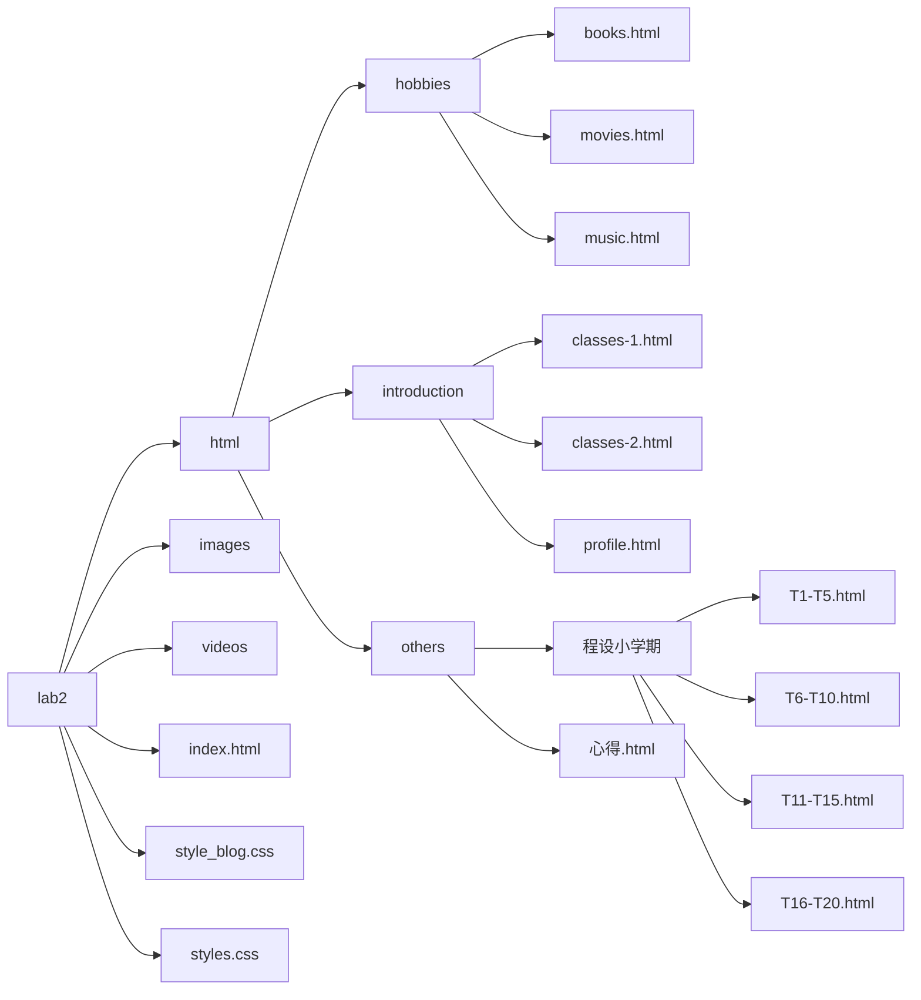
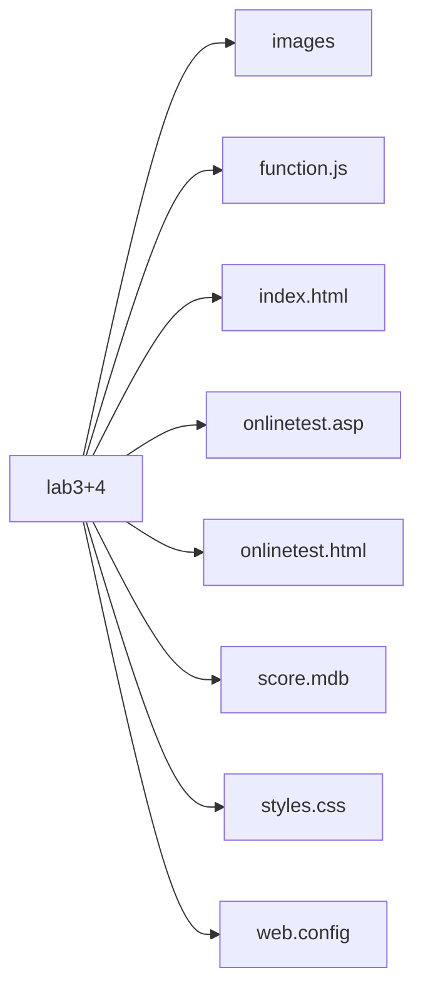

# 《Web开发基础》课程报告

班级: 07112002							学号：1120200822						姓名：郑子帆

 

## 1.  自评四个实验完成度（含附加要求）

实验一：   100%
实验二：   100%
实验三：   100%
实验四：   100%

未完成功能主要包括：
	个人认为无未完成的功能。

除实验要求外 额外完成的功能：
	在Lab2（即个人主页）中，做了一个比较独特的固定的浮窗导航栏；在兴趣爱好一栏中，加入了图片作为超链接，添加了音频控制台；在其他一栏中，加入了小学期的同期课程程序设计与实践的作业题目的题解博客功能；加入了网站icon等。

​	在Lab3（即测试问卷）中，加了一个测试前的准备期间的预备页面；开始测试后在页面顶部加入了测试时间倒计时，添加了当前时间；一共设置了单选题、多选题、判断题、填空题四种类型的题；点击提交后，设计了一个隐藏窗口跳转出来显示总分、各部分得分、开始作答时间、结束作答时间、总用时；当到了预设的测试时长（150s），会跳出窗口提示，并无法再继续作答等。

​	在Lab4（即asp编程）中，用access加了一个属性s_id，以记录测试者的学号信息；成绩表按成绩从大到小排序；对于页面底部的成绩排行榜最开始隐藏，当点击“查看历史成绩”按钮时弹出成绩表。

 

## 2.  请贴出你在IIS中所配置网站的截图


## 3.  请贴出个人主页截图


## 4.  请贴出个人主页 HTML CSS 源代码

lab2文件夹文件存储结构：




index.html:

```html
<!DOCTYPE html>
<html lang="zh">
<head>
    <meta charset="UTF-8">
    <meta http-equiv="X-UA-Compatible" content="IE=edge">
    <meta name="viewport" content="width=device-width, initial-scale=1.0">
    <title>About me</title>
    <link rel="stylesheet" href="/styles.css">
    <link rel="shortcut icon" type="image/x-icon" href="/images/bit.jpg">
</head>
<body>
    <div class="menu" id="#top">
        <ul>
            <li>
                <a href="./index.html">首页</a>
            </li>
            <li>
                <a href="#top">个人简介</a>
                <ul>
                    <li><a href="/html/introduction/profile.html">个人信息</a></li>
                    <li><a href="/html/introduction/classes-1.html">大一课程</a></li>
                    <li><a href="/html/introduction/classes-2.html">大二课程</a></li>
                </ul>
            </li>
            <li>
                <a href="#top">兴趣爱好</a>
                <ul>
                    <li><a href="/html/hobbies/movies.html">最喜欢的电影</a></li>
                    <li><a href="/html/hobbies/music.html">最喜欢的音乐</a></li>
                    <li><a href="/html/hobbies/books.html">最喜欢的书籍</a></li>
                </ul>
            </li>
            <li>
                <a href="#top">其他</a>
                <ul>
                    <li><a href="/html/others/学习心得/心得.html">学习心得</a></li>
                </ul>
            </li>
        </ul>
    </div>

    <div style="margin: 100px;">
        <h1 align = "center">个人网站</h1>
        <p>&nbsp;</p>
        <p>&nbsp;</p>
        <p>
            本网站为小学期web开发基础课第一周所留的Lab2作业，内容为一个有关自我介绍的网站。本网站目前分成了4个大部分：首页、个人简介、兴趣爱好及其他。
            其中，个人简介分为：个人信息、大一课程表、大二课程表；兴趣爱好分为：最喜欢的电影、音乐和书籍；其他这一部分会记录一些自己小学期学习的心得体会以及自己上机实践的总结等等内容。
        </p>
        <p>
            目前由于只学习了较为简单的HTML5、CSS3的知识，还尚未学习JavaScript相关内容，且实践较为生疏，故网站做的略微有些简陋。以后会继续改进。
        </p>
        <p>
            2021.9.20更新：最近学习了简单的JavaScript语言和vbscript，目前基本完成了Lab3和Lab4的制作，
        </p>
        <p>
            附：<a href="http://39.105.202.63/">408宿舍网站</a>
        </p>
    </div>
    <p align="center" style="letter-spacing: 1px; font-size: 15px; margin-bottom: 50px;">
        &copy; copyright2021 版权所有
    </p>
</body>
</html>
```

classes-1.html:

```html
<!DOCTYPE html>
<html lang="en">
<head>
    <meta charset="UTF-8">
    <meta http-equiv="X-UA-Compatible" content="IE=edge">
    <meta name="viewport" content="width=device-width, initial-scale=1.0">
    <title>大一课程</title>
    <link rel="stylesheet" href="/styles.css">
    <link rel="shortcut icon" type="image/x-icon" href="/images/bit.jpg">
</head>
<body>
    <div class="menu" id="#top">
        <ul>
            <li>
                <a href="/index.html">首页</a>
            </li>
            <li>
                <a href="#top">个人简介</a>
                <ul>
                    <li><a href="/html/introduction/profile.html">个人信息</a></li>
                    <li><a href="/html/introduction/classes-1.html">大一课程</a></li>
                    <li><a href="/html/introduction/classes-2.html">大二课程</a></li>
                </ul>
            </li>
            <li>
                <a href="#top">兴趣爱好</a>
                <ul>
                    <li><a href="/html/hobbies/movies.html">最喜欢的电影</a></li>
                    <li><a href="/html/hobbies/music.html">最喜欢的音乐</a></li>
                    <li><a href="/html/hobbies/books.html">最喜欢的书籍</a></li>
                </ul>
            </li>
            <li>
                <a href="#top">其他</a>
                <ul>
                    <li><a href="/html/others/学习心得/心得.html">学习心得</a></li>
                </ul>
            </li>
        </ul>
    </div>
    <div style="margin-top: 80px;">
        <h1 style = "color:brown;">大一第一学期</h1>
        <table class="tb1">
            <tr>
                <td>课程名称</td>
                <td>工程制图C</td>
                <td>大学计算机</td>
                <td>线性代数B</td>
                <td>工科数学分析I</td>
                <td>知识产权法基础</td>
                <td>学术用途英语一级</td>
                <td>思想道德修养与法律基础</td>
                <td>形势与政策I</td>
                <td>习近平新时代中国特色社会主义思想概论</td>
                <td>体育/篮球</td>
                <td>大学生心理素质发展</td>
            </tr>
            <tr>
                <td>学时</td>
                <td>32</td>
                <td>32</td>
                <td>48</td>
                <td>96</td>
                <td>16</td>
                <td>48</td>
                <td>48</td>
                <td>8</td>
                <td>32</td>
                <td>32</td>
                <td>8</td>
            </tr>
            <tr>
                <td>学分</td>
                <td>2</td>
                <td>2</td>
                <td>3</td>
                <td>6</td>
                <td>1</td>
                <td>3</td>
                <td>3</td>
                <td>0.25</td>
                <td>2</td>
                <td>0.5</td>
                <td>0</td>
            </tr>
        </table>
    </div>

    <p>&nbsp;</p>
    <p>&nbsp;</p>
    <p>&nbsp;</p>
    <p>&nbsp;</p>
    
    <div class="centered">
        <hr width="50%"/>
    </div>
    <div style="margin-top: 80px;">
        <h1 style = "color:brown;">大一第二学期</h1>
        <table class="tb1">
            <tr>
                <td>课程名称</td>
                <td>电路分析基础</td>
                <td>程序设计基础</td>
                <td>工科数学分析II</td>
                <td>大学物理A I</td>
                <td>物理实验B I</td>
                <td>学术用途英语二级</td>
                <td>中国近代史纲要</td>
                <td>形势与政策II</td>
                <td>体育/高级篮球</td>
                <td>军事理论</td>
            </tr>
            <tr>
                <td>学时</td>
                <td>64</td>
                <td>48</td>
                <td>96</td>
                <td>64</td>
                <td>32</td>
                <td>48</td>
                <td>48</td>
                <td>8</td>
                <td>32</td>
                <td>36</td>
            </tr>
            <tr>
                <td>学分</td>
                <td>4</td>
                <td>3</td>
                <td>6</td>
                <td>4</td>
                <td>1</td>
                <td>3</td>
                <td>3</td>
                <td>0.25</td>
                <td>0.5</td>
                <td>2</td>
            </tr>
        </table>
    </div>
    <p>&nbsp;</p>
    <p>&nbsp;</p>
    <p>&nbsp;</p>
    <p>&nbsp;</p>
    <div class="centered">
        <hr width="50%"/>
    </div>
    <div style="margin-top: 80px;">
        <h1 style = "color:darkblue;">小学期正在进行的课</h1>
        <ul style="margin: 15px;">
            <li>
                <a href="http://lexue.bit.edu.cn/course/view.php?id=8303" target="_blank">程序设计方法与实践</a>
            </li>
            <li>
                <a href="http://lexue.bit.edu.cn/course/view.php?id=8404" target="_blank">Web开发基础</a>
            </li>
        </ul>
    </div>
    <p>&nbsp;</p>
    <p>&nbsp;</p>
    <p>&nbsp;</p>
    <p align="center" style="letter-spacing: 1px; font-size: 15px; margin-bottom: 50px;">
        &copy; copyright2021 版权所有
    </p>
    
</body>
</html>
```

classes-2.html

```html
<!DOCTYPE html>
<html lang="en">
<head>
    <meta charset="UTF-8">
    <meta http-equiv="X-UA-Compatible" content="IE=edge">
    <meta name="viewport" content="width=device-width, initial-scale=1.0">
    <title>大二课程</title>
    <link rel="stylesheet" href="/styles.css">
    <link rel="shortcut icon" type="image/x-icon" href="/images/bit.jpg">
</head>
<body>
    <div class="menu" id="#top">
        <ul>
            <li>
                <a href="/index.html">首页</a>
            </li>
            <li>
                <a href="#top">个人简介</a>
                <ul>
                    <li><a href="/html/introduction/profile.html">个人信息</a></li>
                    <li><a href="/html/introduction/classes-1.html">大一课程</a></li>
                    <li><a href="/html/introduction/classes-2.html">大二课程</a></li>
                </ul>
            </li>
            <li>
                <a href="#top">兴趣爱好</a>
                <ul>
                    <li><a href="/html/hobbies/movies.html">最喜欢的电影</a></li>
                    <li><a href="/html/hobbies/music.html">最喜欢的音乐</a></li>
                    <li><a href="/html/hobbies/books.html">最喜欢的书籍</a></li>
                </ul>
            </li>
            <li>
                <a href="#top">其他</a>
                <ul>
                    <li><a href="/html/others/学习心得/心得.html">学习心得</a></li>
                </ul>
            </li>
        </ul>
    </div>
    
    <div style="margin-top: 80px;">
        暑假进行了专业分流，最终进入了计算机学院的计算机科学与技术，不然也不会有这个web作业了（bushi
        <p>&nbsp;</p>
        <h1 style = "color:darkcyan;">大二第一学期</h1>
        <table class="tb1">
            <tr>
                <td>课程名称</td>
                <td>数据结构与算法设计</td>
                <td>形势与政策III</td>
                <td>离散数学</td>
                <td>数值分析</td>
                <td>概率与数理统计</td>
                <td>大学物理AII</td>
                <td>物理实验BII</td>
                <td>马克思主义基本原理概论</td>
                <td>体育/健美操</td>
            </tr>
            <tr>
                <td>学时</td>
                <td>80</td>
                <td>8</td>
                <td>64</td>
                <td>32</td>
                <td>48</td>
                <td>64</td>
                <td>32</td>
                <td>48</td>
                <td>32</td>
            </tr>
            <tr>
                <td>学分</td>
                <td>5</td>
                <td>0.25</td>
                <td>4</td>
                <td>2</td>
                <td>3</td>
                <td>4</td>
                <td>1</td>
                <td>3</td>
                <td>0.5</td>
            </tr>
        </table>
    </div>

    <p>&nbsp;</p>
    <p>&nbsp;</p>
    <p>&nbsp;</p>
    <p align="center" style="letter-spacing: 1px; font-size: 15px; margin-bottom: 50px;">
        &copy; copyright2021 版权所有
    </p>
</body>
</html>
```

profile.html:

```html
<!DOCTYPE html>
<html lang="en">
<head>
    <meta charset="UTF-8">
    <meta http-equiv="X-UA-Compatible" content="IE=edge">
    <meta name="viewport" content="width=device-width, initial-scale=1.0">
    <title>个人信息</title>
    <link rel="stylesheet" href="/styles.css">
    <link rel="shortcut icon" type="image/x-icon" href="/images/bit.jpg">
</head>
<body>
    <div class="menu" id="#top">
        <ul>
            <li>
                <a href="/index.html">首页</a>
            </li>
            <li>
                <a href="#top">个人简介</a>
                <ul>
                    <li><a href="/html/introduction/profile.html">个人信息</a></li>
                    <li><a href="/html/introduction/classes-1.html">大一课程</a></li>
                    <li><a href="/html/introduction/classes-2.html">大二课程</a></li>
                </ul>
            </li>
            <li>
                <a href="#top">兴趣爱好</a>
                <ul>
                    <li><a href="/html/hobbies/movies.html">最喜欢的电影</a></li>
                    <li><a href="/html/hobbies/music.html">最喜欢的音乐</a></li>
                    <li><a href="/html/hobbies/books.html">最喜欢的书籍</a></li>
                </ul>
            </li>
            <li>
                <a href="#top">其他</a>
                <ul>
                    <li><a href="/html/others/学习心得/心得.html">学习心得</a></li>
                </ul>
            </li>
        </ul>
    </div>

    <div style="margin-top: 150px;">
        
        <ul style="font-family: 'Courier New', Courier, monospace;">
                
            <li>姓名：郑子帆</li>
            <li>
                现就读学校：<a href="https://www.bit.edu.cn/">北京理工大学</a>
            </li>
            <li>学号：1120200822</li>
            <li>书院/学院：睿信书院/计算机学院</li>
            <li>专业：计算机科学与技术</li>
        </ul>
    </div>
    <p>&nbsp;</p>
    <div>
        <p>
            自认为自己是一个性格比较外向的人，平时比较能说，但人多的时候也会社恐qwq
        </p>
        <p>
            来自北京市朝阳区
        </p>
        <p>
            平常爱好比较喜欢听音乐，原来比较爱听欧美流行音乐，后来有一段时间比较喜欢以EDM为主的电音，现在比较喜欢听说唱类歌曲（中英文皆可），平均每天听歌6h+
            ；以及比较喜欢体育运动，最开始小学的时候先是比较喜欢踢足球，到初高中平常经常打羽毛球、乒乓球，现在上大学后锻炼主要以打篮球、跑步为主。
        </p>
        <p>
            上大学后（迫于学业压力），每天（和很多同学一样）大部分的时间都在综教/文教/理教中度过，其余时间基本就是去操场跑步或者篮球场打球，劳逸结合。
        </p>
    </div>
    <div>
        <p>由于作业中有一项需要插入图片表达自己的心情，于是下面就水两张图片...</p>
        <div style="height: 100px; text-align: center; line-height: 1em; margin-top: 10px;">
            <p>高兴时：</p>
            <p>&nbsp;</p> 
            <p>&nbsp;</p> 
            <p>难过时：</p>
        </div>
        <p>&nbsp;</p>
        <p>&nbsp;</p>
    </div>
    <p align="center" style="letter-spacing: 1px; font-size: 15px; margin-bottom: 50px;">
        &copy; copyright2021 版权所有
    </p>
</body>
</html>
```

movies.html:

```html
<!DOCTYPE html>
<html lang="en">
<head>
    <meta charset="UTF-8">
    <meta http-equiv="X-UA-Compatible" content="IE=edge">
    <meta name="viewport" content="width=device-width, initial-scale=1.0">
    <title>最喜欢的电影</title>
    <link rel="stylesheet" href="/styles.css">
    <link rel="shortcut icon" type="image/x-icon" href="/images/bit.jpg">
</head>
<body>
    <div class="menu" id="#top">
        <ul>
            <li>
                <a href="/index.html">首页</a>
            </li>
            <li>
                <a href="#top">个人简介</a>
                <ul>
                    <li><a href="/html/introduction/profile.html">个人信息</a></li>
                    <li><a href="/html/introduction/classes-1.html">大一课程</a></li>
                    <li><a href="/html/introduction/classes-2.html">大二课程</a></li>
                </ul>
            </li>
            <li>
                <a href="#top">兴趣爱好</a>
                <ul>
                    <li><a href="/html/hobbies/movies.html">最喜欢的电影</a></li>
                    <li><a href="/html/hobbies/music.html">最喜欢的音乐</a></li>
                    <li><a href="/html/hobbies/books.html">最喜欢的书籍</a></li>
                </ul>
            </li>
            <li>
                <a href="#top">其他</a>
                <ul>
                    <li><a href="/html/others/学习心得/心得.html">学习心得</a></li>
                </ul>
            </li>
        </ul>
    </div>

    <div style="margin: 80px;">
        <h1 align="center" style="color: cadetblue;">最喜爱的电影</h1>
        <ul>
           <li>
                <p>
                    <em>肖申克的救赎</em>
                    <a href="https://www.imdb.com/title/tt0111161/" target="_blank" class="movie"></a>
                    
                </p>

            </li>
            <li>
                <p>
                    <em>寻梦环游记</em>
                    <a href="https://www.imdb.com/title/tt2380307/" target="_blank" class="movie" style="margin-left: 22px;"></a>
                </p>
            </li>
            <li>
                <p>
                    <em>复仇者联盟4</em>
                    <a href="https://www.imdb.com/title/tt00004154756/" target="_blank" class="movie" style="margin-left: 10px;"></a>
                </p>
            </li>
            <li>
                <p>
                    ...
                </p>
            </li>
        </ul>
    </div>
    
    <p>&nbsp;</p>
    <p>&nbsp;</p>
    <p>&nbsp;</p>
    <p align="center" style="letter-spacing: 1px; font-size: 15px; margin-bottom: 50px;">
        &copy; copyright2021 版权所有
    </p>
</body>
</html>
```

music.html:

```html
<!DOCTYPE html>
<html lang="en">
<head>
    <meta charset="UTF-8">
    <meta http-equiv="X-UA-Compatible" content="IE=edge">
    <meta name="viewport" content="width=, initial-scale=1.0">
    <title>最喜爱的音乐</title>
    <link rel="stylesheet" href="/styles.css">
    <link rel="shortcut icon" type="image/x-icon" href="/images/bit.jpg">
</head>
<body>
    <div class="menu" id="#top">
        <ul>
            <li>
                <a href="/index.html">首页</a>
            </li>
            <li>
                <a href="#top">个人简介</a>
                <ul>
                    <li><a href="/html/introduction/profile.html">个人信息</a></li>
                    <li><a href="/html/introduction/classes-1.html">大一课程</a></li>
                    <li><a href="/html/introduction/classes-2.html">大二课程</a></li>
                </ul>
            </li>
            <li>
                <a href="#top">兴趣爱好</a>
                <ul>
                    <li><a href="/html/hobbies/movies.html">最喜欢的电影</a></li>
                    <li><a href="/html/hobbies/music.html">最喜欢的音乐</a></li>
                    <li><a href="/html/hobbies/books.html">最喜欢的书籍</a></li>
                </ul>
            </li>
            <li>
                <a href="#top">其他</a>
                <ul>
                    <li><a href="/html/others/学习心得/心得.html">学习心得</a></li>
                </ul>
            </li>
        </ul>
    </div>
    <div align = "right">
    <audio src="/videos/Taylor Swift - Love Story (Taylor's Version).mp3" controls="controls">
        您的浏览器不支持audio标记符
        <embed src="/videos/Taylor Swift - Love Story (Taylor's Version).mp3">
    </audio>
    </div>
    <h1 style="text-align: center; margin-top: 11px; color: blueviolet;">
        最喜欢的音乐
    </h1>
    <div class="music">
        <h2>1 欧美流行音乐</h2>
        <p>
            代表歌星及代表作：
            <ul style="margin-left: 80px;">
                <li>
                    Justin Bieber
                    <ul>
                        <li>
                            <a href="https://y.qq.com/n/ryqq/songDetail/0033qH7G0B1UER">Baby</a>
                        </li>
                        <li>
                            <a href="https://y.qq.com/n/ryqq/songDetail/004HAF5J0HxEZk">What do you mean</a> 
                        </li>
                        <li>
                            <a href="https://y.qq.com/n/ryqq/songDetail/0043EX2e2F6JCA">Stay(Explicit)</a>
                        </li>
                    </ul>
                </li>
                <li>
                    Charlie Puth
                    <ul>
                        <li>
                            <a href="https://y.qq.com/n/ryqq/songDetail/003Nw4jX2Cn1oq">Upside Down</a>
                        </li>
                        <li>
                            <a href="https://y.qq.com/n/ryqq/songDetail/003uNk7n3Fpu7R">We Don't Talk Anymore</a>
                        </li>
                    </ul>
                </li>
                <li>
                    Ed Sheeran
                    <ul>
                        <li>
                            <a href="https://y.qq.com/n/ryqq/songDetail/0041gObR2QG98x">Shape of You</a>
                        </li>
                        <li>
                            <a href="https://y.qq.com/n/ryqq/songDetail/001wPePb1UnitC">Bad Habits</a>
                        </li>
                    </ul>
                </li>
                <li>
                    ...
                </li>
            </ul>
        </p>
        <h2>2 欧美嘻哈音乐</h2>
        <p>
            代表歌星及代表作：

        </p>
    </div>

    <p>&nbsp;</p>
    <p>&nbsp;</p>
    <p>&nbsp;</p>
    <p align="center" style="letter-spacing: 1px; font-size: 15px; margin-bottom: 50px;">
        &copy; copyright2021 版权所有
    </p>

</body>
</html>
```

心得.html:

```html
<!DOCTYPE html>
<html lang="en">
<head>
    <meta charset="UTF-8">
    <meta http-equiv="X-UA-Compatible" content="IE=edge">
    <meta name="viewport" content="width=device-width, initial-scale=1.0">
    <title>学习心得</title>
    <link rel="stylesheet" href="/style_blog.css">
    <link rel="shortcut icon" type="image/x-icon" href="/images/bit.jpg">
    <script type="text/javascript">
        function limitWords(txt){
            var str = txt;
            str = str.substr(0, 200) + "...";
            return str;
        }
    </script>
</head>
<body>
    <div class="menu" id="#top">
        <ul>
            <li>
                <a href="/index.html">首页</a>
            </li>
            <li>
                <a href="#top">个人简介</a>
                <ul>
                    <li><a href="/html/introduction/profile.html">个人信息</a></li>
                    <li><a href="/html/introduction/classes-1.html">大一课程</a></li>
                    <li><a href="/html/introduction/classes-2.html">大二课程</a></li>
                </ul>
            </li>
            <li>
                <a href="#top">兴趣爱好</a>
                <ul>
                    <li><a href="/html/hobbies/movies.html">最喜欢的电影</a></li>
                    <li><a href="/html/hobbies/music.html">最喜欢的音乐</a></li>
                    <li><a href="/html/hobbies/books.html">最喜欢的书籍</a></li>
                </ul>
            </li>
            <li>
                <a href="#top">其他</a>
                <ul>
                    <li><a href="/html/others/学习心得/心得.html">学习心得</a></li>
                </ul>
            </li>
        </ul>
    </div>
    <p>&nbsp;</p>
    <div align="center">
        <a href="/html/others/学习心得/程设小学期/T1-T5.html">
            <div class="blog" style="margin-top: 50px; text-align: left;">
                <p style="padding: 10px;">
                    程设小学期 T1-T5 题解<br>
                    1 A+B (I) <br>
                    2 解谜游戏<br>
                    3 军训日记<br>
                    ...
                </p>
            </div>
        </a>
        <p>&nbsp;</p>
        
        <a href="/html/others/学习心得/程设小学期/T6-T10.html">
            <div class="blog" style="margin-top: 50px; text-align: left;">
                <p style="padding: 10px;">
                    程设小学期 T6-T10 题解<br>
                    6 改作文<br>
                    7 一夜发白《千字文》<br>
                    8 军训日记：报数！<br>
                    ...
                </p>
            </div>
        </a>
        <p>&nbsp;</p>

        <a href="/html/others/学习心得/程设小学期/T11-T15.html">
            <div class="blog" style="margin-top: 50px; text-align: left;">
                <p style="padding: 10px;">
                    程设小学期 T11-T15 题解
                </p>
            </div>
        </a>
        <p>&nbsp;</p>
        <a href="/html/others/学习心得/程设小学期/T16-T20.html">
            <div class="blog" style="margin-top: 50px; text-align: left;">
                <p style="padding: 10px;">
                    程设小学期 T16-T20 题解
                </p>
            </div>
        </a>
    </div>
</body>
</html>
```

T1-T5.html:

```html
<!DOCTYPE html>
<html lang="zh">
<head>
    <meta charset="UTF-8">
    <meta http-equiv="X-UA-Compatible" content="IE=edge">
    <meta name="viewport" content="width=device-width, initial-scale=1.0">
    <title>About me</title>
    <link rel="stylesheet" href="/styles.css">
    <link rel="shortcut icon" type="image/x-icon" href="/images/bit.jpg">
</head>
<body>
    <div class="menu" id="#top">
        <ul>
            <li>
                <a href="./index.html">首页</a>
            </li>
            <li>
                <a href="#top">个人简介</a>
                <ul>
                    <li><a href="./html/introduction/profile.html">个人信息</a></li>
                    <li><a href="./html/introduction/classes-1.html">大一课程</a></li>
                    <li><a href="./html/introduction/classes-2.html">大二课程</a></li>
                </ul>
            </li>
            <li>
                <a href="#top">兴趣爱好</a>
                <ul>
                    <li><a href="./html/hobbies/movies.html">最喜欢的电影</a></li>
                    <li><a href="./html/hobbies/music.html">最喜欢的音乐</a></li>
                    <li><a href="./html/hobbies/books.html">最喜欢的书籍</a></li>
                </ul>
            </li>
            <li>
                <a href="#top">其他</a>
                <ul>
                    <li><a href="/html/others/学习心得/心得.html">学习心得</a></li>
                </ul>
            </li>
        </ul>
    </div>
    <div style="margin-top: 80px; margin-left: 150px; margin-right: 150px;">
        <p style="text-indent: 0em;">
            1 A+B (I)
            <br>
            这道题就是一个二进制的高精度加法，注意一下进位的问题。然后这道题输出答案的时候-的个数是ans的长度+2。对于多组询问，一定注意之前数组的值不要对当前询问产生影响，最好memset初始化一下。
            <br><br>
            2 解谜游戏
            <br>
            这道题显然可以得知每个点最多被按一次，且按的顺序对最终结果没有任何影响，所以说我们可以$2^m$​暴力枚举第一行的操作状态，然后之后对于第i行的亮暗状态(0/1)，我们可以得知第i+1行的操作，使得前i行全暗（0）（例如，第i行第j列是1，那么我们对第i+1行第j列要按一次，使得其变为0），然后最后注意判断第n行是否全0然后更新一下ans。
            <br><br>
            3 军训日记
            <br>
            1~n中，含质因数2的数的个数最多，然后我们肯定是要让它们分散开来，这样要分​$\lfloor \frac{n}{2} \rfloor$个集合（1可以扔到任意一个集合中），然后对于之后的奇合数，由于相邻两数互质，将其扔到比它小1的偶数的集合中即可。注意n=1的时候要特判一下。
            <br><br>
            4 北湖挖坑
            <br>
            这个好像就是noip2018的某个t1原题，我们把它倒过来，想象成对每个位置建一个高度为b[i] = h-a[i]的山。那么考虑贪心。对于当前第i位，考虑i-1填完后，为了填满i位置，要单独再填多少次。若i-1位置的高度 &< i位置要建的高度，那么将二者的高度差累加到答案中。这样做法的正确性我们可以考虑如果b[i-1]=b[i]，那么二者可以捆绑看成一个位置，一起被填；若b[i-1]>b[i]那么我们就认为是在达到b[i]高度前二者被捆绑在一起被填，然后当到了高度b[i]，舍弃i位置，i-1位置继续填；若b[i-1] b[i]，那么我们填到b[i-1]高度时，i位置要单独再花b[i]-b[i-1]次填满。注意开long long
            <br><br>
            5 北湖深坑
            <br>
            这道题我们考虑对于第i个位置，能装多少水。易知对于当前位置，它能装的最大的高度就是它左边的最高高度和右边的最高高度取min，不然装的更多会从一侧溢出。所以我们O(n)扫一遍得到每个位置左边的最大高度和右边的最大高度。还是注意开long long统计答案
        </p>
    </div>
    <p align="center" style="letter-spacing: 1px; font-size: 15px; margin-bottom: 50px; margin-top: 60px;">
        &copy; copyright2021 版权所有
    </p>
</body>
</html>
```

style_blog.css:

```css
body{
    background: url(./images/bg.png);
    background-repeat: no-repeat;
    background-size: 100% 100%;
    background-attachment: fixed;
}
/*
    横向导航栏
*/
*{
    margin: 0px;
    padding: 0px;
}
.menu{
    font-family: 楷体;
    position: fixed;
    width: 600px;
    height: 48px;
    background-color: #e8e7e3;
    opacity: 0.8;
    position: fixed;
    top: 0px;
    left: 0px;
    right: 0px;
    margin-left:auto;
    margin-right:auto;
}
.menu ul{
    list-style: none;
}
.menu ul li{
    float: left;
    position: relative;
}
.menu ul li a, .menu ul li a:visited{
    text-align: center;
    line-height: 48px;
    display: block;
    text-decoration: none;
    color: #777777;
    font-size: 18px;
    width: 150px;
    /* padding: 0 40px; */
}
.menu ul li ul{
    display: none;
}
.menu ul li:hover a{
    background-color: #3f3f3f;
    color: #e8e7e3;
}
.menu ul li:hover ul{
    display: block;
    position: absolute;
    top: 48px;
    left: 0px;
}
.menu ul li:hover ul li a{
    display: block;
    background-color: #e8e7e3;
    color: #777777;
}
.menu ul li:hover ul li a:hover{
    background-color: #3f3f3f;
    color: #e8e7e3;
}

a:link{color: black; text-decoration: none;}
a:visited{color: gray; text-decoration: none;}
a:hover{color: red; text-decoration: none;}
a:active{color:gray; text-decoration: none;}

/*
    博客页摘要制作
*/
.blog{
    display: block;
    border: 1px solid black;
    border-bottom-left-radius: 10px;
    border-bottom-right-radius: 10px;
    border-top-left-radius: 10px;
    border-top-right-radius: 10px;
    width: 40%;
    height: 150px;
}
p{
    font-family: 宋体;
    font-size: 20px;
    letter-spacing: 2px;
    text-indent: 2em;
}
```

styles.css:

```css
body{
    background: url(./images/bg.png);
    background-repeat: no-repeat;
    background-size: 100% 100%;
    background-attachment: fixed;
}

h1{
    font-family: "Lucida Handwriting", 宋体;
}
h2{
    font-family: 仿宋;
}
li{
    font-size: larger;
}

p{
    font-family: 宋体;
    font-size: 20px;
    letter-spacing: 2px;
    text-indent: 2em;
}

div{
    line-height: 2.5em;
    margin-left: 100px;
    margin-right: 100px;
}

/* 
    将图片位于居中
*/
.centered{
    text-align: center;
}

/*
    图片超链接
*/
.movie img{
    opacity: 0.7;
    margin: 20px;
}
.movie img:hover{
    opacity: 1.0;
}

/*
    图片与文本中央对齐
*/
.v1{vertical-align: middle;}

/*
    图片环绕文本左边
*/
.s1{float: left; margin-right: 30px;}


/*
    超链接制作
*/
a:link{color: black; text-decoration: none;}
a:visited{color: gray; text-decoration: none;}
a:hover{color: red; text-decoration: none;}
a:active{color:gray; text-decoration: none;}

/*
    横向导航栏
*/
*{
    margin: 0px;
    padding: 0px;
}
.menu{
    font-family: 楷体;
    position: fixed;
    width: 600px;
    height: 48px;
    background-color: #e8e7e3;
    opacity: 0.8;
    position: fixed;
    top: 0px;
    left: 0px;
    right: 0px;
    margin-left:auto;
    margin-right:auto;
}
.menu ul{
    list-style: none;
}
.menu ul li{
    float: left;
    position: relative;
}
.menu ul li a, .menu ul li a:visited{
    text-align: center;
    line-height: 48px;
    display: block;
    text-decoration: none;
    color: #777777;
    font-size: 18px;
    width: 150px;
    /* padding: 0 40px; */
}
.menu ul li ul{
    display: none;
}
.menu ul li:hover a{
    background-color: #3f3f3f;
    color: #e8e7e3;
}
.menu ul li:hover ul{
    display: block;
    position: absolute;
    top: 48px;
    left: 0px;
}
.menu ul li:hover ul li a{
    display: block;
    background-color: #e8e7e3;
    color: #777777;
}
.menu ul li:hover ul li a:hover{
    background-color: #3f3f3f;
    color: #e8e7e3;
}

/*
    关于table表格
*/
.tb1{
    border-collapse: collapse;
    border: 1px solid black;
    padding: 5px 5px;
}
.tb1 tr td{
    border-left: 1px solid black;
    padding: 10px;
    width: 100px;
}
/*
    音乐页的操作
*/
.music ul li ul li{
    font-size: smaller;
}
.music ul li ul{
    margin-left: 20px;
    line-height: 1.5em;
}
```

## 5.  请贴出 在线考试页面 初始截图


## 6.  做一套非全对测试 贴出关键过程截图

提交成绩前

 

提交后弹出成绩对话框


写入数据库后页面


列出历史考试成绩页面


## 7.  请贴出实验三（四）全部源代码

 lab3+4文件夹文件存储结构：



function.js:

```javascript
var maxtime = 150;
var sttime, sttimeString, edtime, edtimeString;

var div = document.getElementById("background-pop");
var close = document.getElementById("close-button");
var ranklist = document.getElementById("myrk");

function getDate(){
    var h = document.getElementById("greeting");
    var arrayDay = ["日", "一", "二", "三", "四", "五", "六"];
    var date = new Date();
    var time = date.getHours();
    if(time >= 0 && time <= 6){
        h.innerHTML = "凌晨好, 欢迎来到国防知识竞赛测试";
    }
    if (time > 6 && time <= 10){
        h.innerHTML = "早上好, 欢迎来到国防知识竞赛测试";
    }
    else if (time > 10 && time <= 14){
        h.innerHTML = "中午好, 欢迎来到国防知识竞赛测试";
    }
    else if(time > 14 && time <= 18){
        h.innerHTML = "下午好, 欢迎来到国防知识竞赛测试";
    }
    else if (time > 18){
        h.innerHTML = "晚上好, 欢迎来到国防知识竞赛测试";
    }
    h.innerHTML += "<br>"; h.innerHTML += "现在是";
    var localdate = date.toLocaleString();
    var myday = date.getDay();
    h.innerHTML += localdate;
    h.innerHTML += "    星期" + arrayDay[myday];
}
setInterval("getDate()", 1000);


function TimeCountDown(){    
    var h = document.getElementById("LeftTime");
    if(maxtime >= 0){
        h.innerHTML = "距离测试结束还有" + maxtime + "秒";
    }
    else {
        clearInterval(LeftTimePoint);
        alert("时间到！请停止作答！！！");
    }
    if(maxtime == 150){
        sttime = new Date();
        sttimeString = sttime.toLocaleString();
    }
    maxtime --;
}
LeftTimePoint = setInterval("TimeCountDown()", 1000);


var Sumscore = 0;
function GetMyScore(){
    clearInterval(LeftTimePoint);
    edtime = new Date();
    edtimeString = edtime.toLocaleString();

    var idList = ["0", "1", "2", "3", "4", "5", "6", "7", "8", "9", "10", "11", "12", "13", "14", "15", "16", "17", "18", "19", "20", "21", "22", "23", "24", "25", "26", "27", "28", "29", "30", "31", "32", "33", "34", "35", "36", "37", "38"];
    var answer = ["0", "A", "B", "C", "B", "D", "A", "ACD", "ABD", "F", "T", "八七", "学校"];
    var score = [0, 0, 0, 0, 0, 0];
    var i, j, myans, news;
    news = document.getElementsByClassName("div-content");
    for(i = 1; i <= 8; i ++){
        myans = "";
        for(j = (i - 1) * 4 + 1; j <= (i - 1) * 4 + 4; j ++){
            var x = document.getElementById(idList[j]);
            if(x.checked) myans = myans + x.value;
        }
        if(myans == answer[i]){
            if(i <= 6) score[1] += 10;
            else if(i <= 8) score[2] += 15;
        }
    }//单选题 and 多选题 的 判分
    for(i = 9; i <= 10; i ++){
        myans = "";
        for(j = 32 + (i - 9) * 2 + 1; j <= 32 + (i - 9) * 2 + 2; j ++){
            var x = document.getElementById(idList[j]);
            if(x.checked) myans = myans + x.value;
        }
        if(myans == answer[i]) score[3] += 5;
    }//判断题 的 判分
    for(i = 11; i <= 12; i ++){
        myans = "";
        var x;
        if(i == 11) x = document.getElementById(idList[37]).value;
        if(i == 12) x = document.getElementById(idList[38]).value;
        myans = myans + x;
        if(myans == answer[i]) score[4] = score[4] + 10;
    }
    for(i = 1; i <= 4; i ++) Sumscore += score[i];
    news[0].innerHTML += "您的最终测试成绩为：" + Sumscore + "/120分" + "<br>" + "其中，单选题" + score[1] + "分；多选题" + score[2] + "分；判断题" + score[3] + "分；填空题" + score[4] + "分。<br>" + "开始作答时间：" + sttimeString + "<br>" + "结束作答时间：" + edtimeString + "<br>" + "共用时 " + (150-maxtime) + " 秒。<br>";
    document.getElementsByName("score")[0].value=Sumscore;
	document.getElementsByName("username1")[0].value=document.getElementsByName("txtName")[0].value;
    document.getElementsByName("userid1")[0].value=document.getElementsByName("txtIdnumber")[0].value;
    show();
}

function StopWritting(quizID){
    var x = document.getElementById(String(quizID));
    if(maxtime < 0){
        alert("时间已到，不能再继续作答！");
        x.checked = false;
    }
}

function geturl(){
    var url = window.location.search.substring(1);
    var res = url.match(/mark=1/i);
    if(res == "mark=1"){
        ranklist.style.display = "block";
    }
}
function show(){
    div.style.display = "block";
}
close.onclick = function close(){
    div.style.display = "none";
}
window.onclick = function close(e){
    if(e.target == div){
        div.style.display = "none";
    }
}
```

index.html:

```html
<!DOCTYPE html>
<html lang="en">
<head>
    <meta charset="UTF-8">
    <meta http-equiv="X-UA-Compatible" content="IE=edge">
    <meta name="viewport" content="width=device-width, initial-scale=1.0">
    <link rel="shortcut icon" type="image/x-icon" href="/images/bit.jpg">
    <link rel="stylesheet" href="./styles.css">
    <title>国防知识竞赛</title>
</head>
<body>
    <div align = "center" style="margin: 80px auto;">
        <h1>
            欢迎来到国防知识竞赛测试
        </h1>
        <p style="margin-top: 70px;">
            本次的测试题摘自<a href="/北京理工大学国防知识竞赛题库（一）.pdf">北京理工大学国防知识竞赛题库（一）.pdf</a>
        </p>
        <p style="margin-top: 70px; color: red;">
            本次考试一共150s，跳转页面即开始计时
        </p>
        <p style="margin-top: 70px;">
            如果您已准备好，请点击下方“开始测试”按钮以开始进行测试
        </p>
        <p style="margin-top: 70px;">
            <input type="button" name="begin_button" value="开始测试" onclick="location.href='./onlinetest.html'" style="width: 80px; height: 40px;">
        </p>
    </div>
    <p align="center" style=" margin-top: 250px; letter-spacing: 1px; font-size: 15px; margin-bottom: 50px;">
        &copy; copyright2021 版权所有
    </p>
</body>
</html>
```

onlinetest.asp:

```asp
<% @Language="vbscript" Codepage="65001"%>
<html>
<head>
    <meta http-equiv="Content-Type" content="text/html;charset=utf-8">	
    <link rel="shortcut icon" type="image/x-icon" href="/images/bit.jpg">
    <link rel="stylesheet" href="styles.css">
    <title>竞赛试卷</title>
</head>
<body onload="geturl()">
    <h1 style="text-align: center; margin-top: 50px;">
        国防知识竞赛测试卷
    </h1>
    <div style="margin-left: 50px;">
        <h1 id="greeting" style="margin-left: 60px; font-size: 25px; font-family: 楷体; color:blueviolet;"></h1>
        <h1 id="LeftTime" style="margin-left: 60px; font-size: 20px; font-family: 楷体; color:royalblue;"></h1>
        <h2 style="text-indent: 2em;">
            <em>
                本次测试共有3种题型，题量设置及分数分布如下：<br>
            </em>
            <p style="text-indent: 4em;">
                单选题（6*10=60）、多选题（2*15=30）、判断题（2*5=10）、填空题(2*10=20)，内容包括但不限于国防知识基础、兵器知识等。
            </p>
            
        </h2>
    </div>
    <form action="onlinetest.asp?mark=1" style="margin-left: 50px; margin-right: 50px;" method="POST">
        <p style="font-size: 27px; text-indent: 1em;">
            <label for="name">姓名：</label><input type="text" name = "txtName" id="name" size="20" placeholder="请输入您的姓名" style="height: 25px;">
            <br>
            <div style="margin-left: 28px">
                <label for="idkey">学号：</label><input type="text" name="txtIdnumber" id="idkey" size="20" placeholder="请输入您的10位学号" style="height: 25px;">
            </div>
        </p>
        <p style="font-size: 27px; text-indent: 1em;">一、单选题</p>
        <p>1.中华人民共和国( )，不分民族、种族、职业，家庭出身，宗教信仰，教育程度都有义务依照兵役法的规定服兵役。</p>
        <p>
            <input type="radio" name="q1" id="1" value="A" onclick="StopWritting(1)"><label for="1">A.公民</label>&nbsp;
            <input type="radio" name="q1" id="2" value="B" onclick="StopWritting(2)"><label for="2">B.人民</label>&nbsp;
            <input type="radio" name="q1" id="3" value="C" onclick="StopWritting(3)"><label for="3">C.青年</label>&nbsp;
            <input type="radio" name="q1" id="4" value="D" onclick="StopWritting(4)"><label for="4">D.少年</label>
        </p>
        <p>2.1941 年，皖南新四军军部直属部队等 9 千余人，在叶挺、项英率领下开始北移。1 月 6 日，当部队到达茂林地区时，遭到国民党 7 个师约 8 万人的突然袭击。新四军英勇抗击，激战 7 昼夜，除傅秋涛率领 2000 余人分散突围外，少数被俘，大部壮烈牺牲。军长叶挺被俘，副军长项英、参谋长周子昆突围后遇难，政治部主任袁国平牺牲。这就是震惊中外的（ ），是国民党第二次反共高潮的高峰。
        </p>
        <p>
            <input type="radio" name="q2" id="5" value="A" onclick="StopWritting(5)"><label for="5">A.陈桥驿事变</label>&nbsp;
            <input type="radio" name="q2" id="6" value="B" onclick="StopWritting(6)"><label for="6">B.皖南事变</label>&nbsp;
            <input type="radio" name="q2" id="7" value="C" onclick="StopWritting(7)"><label for="7">C.八一三事变</label>&nbsp;
            <input type="radio" name="q2" id="8" value="D" onclick="StopWritting(8)"><label for="8">D.双十二事变</label>
        </p>
        <p>3.歼-20 是中航工业成都飞机工业集团公司研制的一款具备高隐身性、高态势感知、高机动性等能力的隐形第( )代战斗机（按照西方划分标准）。于 2011年 1 月 11 日在成都黄田坝军用机场实现首飞。2016 年 11 月 1 日，歼-20 参加珠海航展并首次对外进行双机飞行展示。
        </p>
        <p>
            <input type="radio" name="q3" id="9" value="A" onclick="StopWritting(9)"><label for="9">A.四</label>&nbsp;
            <input type="radio" name="q3" id="10" value="B" onclick="StopWritting(10)"><label for="10">B.三</label>&nbsp;
            <input type="radio" name="q3" id="11" value="C" onclick="StopWritting(11)"><label for="11">C.五</label>&nbsp;
            <input type="radio" name="q3" id="12" value="D" onclick="StopWritting(12)"><label for="12">D.六</label>
        </p>
        <p>4.中国人民解放军政治工作的三大原则是：（ ）。</p>
        <p>
            <input type="radio" name="q4" id="13" value="A" onclick="StopWritting(13)"><label for="13">A.官兵一致、军民一致、合法行政</label><br>
            <input type="radio" name="q4" id="14" value="B" style="margin-left: 54px;" onclick="StopWritting(14)"><label for="14">B.官兵一致、瓦解敌军、合法行政</label><br>
            <input type="radio" name="q4" id="15" value="C" style="margin-left: 54px;" onclick="StopWritting(15)"><label for="15">C.合法行政、军民一致、瓦解敌军</label><br>
            <input type="radio" name="q4" id="16" value="D" style="margin-left: 54px;" onclick="StopWritting(16)"><label for="16">D.瓦解敌军、官兵一致、军民一致</label>
        </p>
        <p>5.《战争论》被誉为西方近代军事理论的经典之作，对近代西方军事思想的形成和发展起了重大作用，由（ ）国军事理论家（ ）所著。</p>
        <p>
            <input type="radio" name="q5" id="17" value="A" onclick="StopWritting(17)"><label for="17">A.德 俾斯麦</label>&nbsp;
            <input type="radio" name="q5" id="18" value="B" onclick="StopWritting(18)"><label for="18">B.美 艾森豪威尔</label>&nbsp;
            <input type="radio" name="q5" id="19" value="C" onclick="StopWritting(19)"><label for="19">C.德 克劳塞维茨</label>&nbsp;
            <input type="radio" name="q5" id="20" value="D" onclick="StopWritting(20)"><label for="20">D.英 蒙哥马利</label>
        </p>
        <p>6.洲际弹道导弹发射井由于其体积巨大，导致很容易被敌方提前探知，战时极易遭到打击和摧毁。其往往会于潜射弹道导弹、战略轰炸机共同构成核陆基、海基、天基打击方式，这被称为（ ）。
        </p>
        <p>
            <input type="radio" name="q6" id="21" value="A" onclick="StopWritting(21)"><label for="21">A.核三位一体</label>&nbsp;
            <input type="radio" name="q6" id="22" value="B" onclick="StopWritting(22)"><label for="22">B.饱和攻击</label>&nbsp;
            <input type="radio" name="q6" id="23" value="C" onclick="StopWritting(23)"><label for="23">C.核讹诈</label>&nbsp;
            <input type="radio" name="q6" id="24" value="D" onclick="StopWritting(24)"><label for="24">D.核扩散</label>
        </p>
        <p>&nbsp;</p>
        <p style="font-size: 27px; text-indent: 1em;">二、多选题</p>
        <p>
            7.关于美国海军的中途岛级航空母舰，下列说法正确的是（）。
        </p>
        <p>
            <input type="checkbox" name="q7" id="25" value="A" onclick="StopWritting(25)"><label for="25">A.它是接替埃塞克斯级的下一代舰队航母</label><br>
            <input type="checkbox" name="q7" id="26" value="B" style="margin-left: 54px;" onclick="StopWritting(26)"><label for="26">B.排水量超过了之前建造的所有航母</label><br>
            <input type="checkbox" name="q7" id="27" value="C" style="margin-left: 54px;" onclick="StopWritting(27)"><label for="27">C.建成时是全通直甲板航空母舰</label><br>
            <input type="checkbox" name="q7" id="28" value="D" style="margin-left: 54px;" onclick="StopWritting(28)"><label for="28">D.其中的“珊瑚海”号经历了大规模改装</label>
        </p>
        <p>
            8.以下关于 051 型驱逐舰说法错误的是（）。
        </p>
        <p>
            <input type="checkbox" name="q8" id="29" value="A" onclick="StopWritting(29)"><label for="29">A.该级舰是我国自行设计建造的第一型导弹驱逐舰</label><br>
            <input type="checkbox" name="q8" id="30" value="B" style="margin-left: 54px;" onclick="StopWritting(30)"><label for="30">B.该级舰的设计参考了前苏联 56 型（科特林）级驱逐舰</label><br>
            <input type="checkbox" name="q8" id="31" value="C" style="margin-left: 54px;" onclick="StopWritting(31)"><label for="31">C.该级舰装备了我国自行研发的“上游 1 号”反舰导弹</label><br>
            <input type="checkbox" name="q8" id="32" value="D" style="margin-left: 54px;" onclick="StopWritting(32)"><label for="32">D.该级舰是为了我国第二炮兵部队的建设而设计建造的</label>
        </p>
        <p>&nbsp;</p>
        <p style="font-size: 27px; text-indent: 1em;">三、判断题</p>
        <p>
            9.集束炸弹是在与一般炸弹同样大小的弹体中，装入由数十个到数千个的子炸弹，子炸弹每颗约网球般大小的球体。由飞行器空投之后，在空中分解，借由散布子炸弹到广范的地面造成区域性杀伤。            
        </p>
        <p>
            <input type="radio" name="q9" id="33" value="T" onclick="StopWritting(33)"><label for="33">A.正确</label><br>
            <input type="radio" name="q9" id="34" value="F" style="margin-left: 54px;" onclick="StopWritting(34)"><label for="34">B.错误</label><br>
        </p>
        <p>
            10.当前世界军事领域正在进行一场深刻的新军事变革，变革的核心是实现信息化。            
        </p>
        <p>
            <input type="radio" name="q10" id="35" value="T" onclick="StopWritting(35)"><label for="35">A.正确</label><br>
            <input type="radio" name="q10" id="36" value="F" style="margin-left: 54px;" onclick="StopWritting(36)"><label for="36">B.错误</label><br>
        </p>
        <p>
            11.在党的______会议上毛泽东提出了“枪杆子里出政权”的著名论断。
        </p>
        <p>
            <input type="text" name = "q11" id="37" size="20" placeholder="请输入答案" onclick="StopWritting(37)" style="height: 25px;">
        </p>
        <p>
            12._______的国防教育，是全民国防教育的基础。
        </p>
        <p>
            <input type="text" name = "q12" id="38" size="20" placeholder="请输入答案" onclick="StopWritting(38)" style="height: 25px;">
        </p>

        <input type="hidden" runat="server" name="score"/>
        <input type="hidden" name="username1" />
        <input type="hidden" name="userid1">

        <div style="margin-left: 60px; margin-top: 50px;">
            <input type="button" value="提交" onclick="GetMyScore()" style="width: 70px; height: 35px;">
            <input type="reset" value="重写" style="width: 70px; height: 35px; margin-left: 20px;">
        </div>
        <center>
            <input type="submit" value="查看历史测试成绩" style="width:150px;height:50px;background:chocolate; font-size: 16px; cursor: pointer"/>
        </center>
    </form>
    
    <%
        set conn=Server.CreateObject("ADODB.Connection")
        conn.Provider="Microsoft.Jet.OLEDB.4.0"
        conn.Open  "C:\lab3+4\score.mdb"

        sql="INSERT INTO score (s_name,s_id,s_score)"
        sql=sql & " VALUES "
        sql=sql & "('" & request.Form("username1") & "',"
        sql=sql & "'" & request.Form("userid1") & "',"
        sql=sql & "'" & request.Form("score") & "')"

        on error resume next
        conn.Execute sql,recaffected
        if err<>0 then
            Response.Write("No update permissions!")
        end if

        
        set rs = Server.CreateObject("ADODB.recordset")
            sql="SELECT s_name,s_id,s_score FROM score"
        rs.Open "SELECT * FROM score ORDER BY s_score DESC",conn
    %>

    <div id="background-pop">
        <div id="div-pop">
            <div class="div-top">
                <span id="close-button">× </span>
                <div>测试结果</div>
            </div>
            <div class="div-content">

            </div>
            <div class="div-footer">
                国防知识竞赛
            </div>
        </div>
    </div>
    
    <div id="myrk" style="margin-top: 20px;">
        <h1 style="color: blueviolet; text-align: center; font-size: 30px;">测试成绩排行榜</h1>
        <center>
            <table border='1'>
                <tr>
                    <th style="width: 8em;">编号</th>
                    <th style="width: 8em;">姓名</th>
                    <th style="width: 8em;">学号</th>
                    <th style="width: 8em;">测试成绩</th>
                </tr>
                <%
                    rs.Movefirst
                    do until rs.eof
                        for each x in rs.Fields
                %>
                <td>
                <%
                    Response.Write(x.value)
                %>
                </td>
                <%
                    next
                    rs.MoveNext
                %>
                </tr>
                <%
                    loop
                    rs.close
                    conn.close
                %>
            </table>
        </center>
    </div>


    <p align="center" style=" margin-top: 70px; letter-spacing: 1px; font-size: 15px; margin-bottom: 50px;">
        &copy; copyright2021 版权所有
    </p> 


    <script src="function.js">
        
    </script>

</body>
</html>
```

onlinetest.html:

```html
<!DOCTYPE html>
<html lang="en">
<head>
    <meta charset="UTF-8">
    <meta http-equiv="X-UA-Compatible" content="IE=edge">
    <meta name="viewport" content="width=device-width, initial-scale=1.0">
    <link rel="shortcut icon" type="image/x-icon" href="./images/bit.jpg">
    <link rel="stylesheet" href="./styles.css">
    <title>竞赛试卷</title>

    

</head>
<body>
    <h1 style="text-align: center; margin-top: 50px;">
        国防知识竞赛测试卷
    </h1>
    <div style="margin-left: 50px;">
        <h1 id="greeting" style="margin-left: 60px; font-size: 25px; font-family: 楷体; color:blueviolet;"></h1>
        <h1 id="LeftTime" style="margin-left: 60px; font-size: 20px; font-family: 楷体; color:royalblue;"></h1>
        <h2 style="text-indent: 2em;">
            <em>
                本次测试共有3种题型，题量设置及分数分布如下：<br>
            </em>
            <p style="text-indent: 4em;">
                单选题（6*10=60）、多选题（2*15=30）、判断题（2*5=10）、填空题(2*10=20)，内容包括但不限于国防知识基础、兵器知识等。
            </p>
            
        </h2>
    </div>
    <form style="margin-left: 50px; margin-right: 50px;">
        <p style="font-size: 27px; text-indent: 1em;">
            <label for="name">姓名：</label><input type="text" name = "txtName" id="name" size="20" placeholder="请输入您的姓名" style="height: 25px;">
            <br>
            <div style="margin-left: 28px">
                <label for="idkey">学号：</label><input type="text" name="txtIdnumber" id="idkey" size="20" placeholder="请输入您的10位学号" style="height: 25px;">
            </div>
        </p>
        <p style="font-size: 27px; text-indent: 1em;">一、单选题</p>
        <p>1.中华人民共和国( )，不分民族、种族、职业，家庭出身，宗教信仰，教育程度都有义务依照兵役法的规定服兵役。</p>
        <p>
            <input type="radio" name="q1" id="1" value="A" onclick="StopWritting(1)"><label for="1">A.公民</label>&nbsp;
            <input type="radio" name="q1" id="2" value="B" onclick="StopWritting(2)"><label for="2">B.人民</label>&nbsp;
            <input type="radio" name="q1" id="3" value="C" onclick="StopWritting(3)"><label for="3">C.青年</label>&nbsp;
            <input type="radio" name="q1" id="4" value="D" onclick="StopWritting(4)"><label for="4">D.少年</label>
        </p>
        <p>2.1941 年，皖南新四军军部直属部队等 9 千余人，在叶挺、项英率领下开始北移。1 月 6 日，当部队到达茂林地区时，遭到国民党 7 个师约 8 万人的突然袭击。新四军英勇抗击，激战 7 昼夜，除傅秋涛率领 2000 余人分散突围外，少数被俘，大部壮烈牺牲。军长叶挺被俘，副军长项英、参谋长周子昆突围后遇难，政治部主任袁国平牺牲。这就是震惊中外的（ ），是国民党第二次反共高潮的高峰。
        </p>
        <p>
            <input type="radio" name="q2" id="5" value="A" onclick="StopWritting(5)"><label for="5">A.陈桥驿事变</label>&nbsp;
            <input type="radio" name="q2" id="6" value="B" onclick="StopWritting(6)"><label for="6">B.皖南事变</label>&nbsp;
            <input type="radio" name="q2" id="7" value="C" onclick="StopWritting(7)"><label for="7">C.八一三事变</label>&nbsp;
            <input type="radio" name="q2" id="8" value="D" onclick="StopWritting(8)"><label for="8">D.双十二事变</label>
        </p>
        <p>3.歼-20 是中航工业成都飞机工业集团公司研制的一款具备高隐身性、高态势感知、高机动性等能力的隐形第( )代战斗机（按照西方划分标准）。于 2011年 1 月 11 日在成都黄田坝军用机场实现首飞。2016 年 11 月 1 日，歼-20 参加珠海航展并首次对外进行双机飞行展示。
        </p>
        <p>
            <input type="radio" name="q3" id="9" value="A" onclick="StopWritting(9)"><label for="9">A.四</label>&nbsp;
            <input type="radio" name="q3" id="10" value="B" onclick="StopWritting(10)"><label for="10">B.三</label>&nbsp;
            <input type="radio" name="q3" id="11" value="C" onclick="StopWritting(11)"><label for="11">C.五</label>&nbsp;
            <input type="radio" name="q3" id="12" value="D" onclick="StopWritting(12)"><label for="12">D.六</label>
        </p>
        <p>4.中国人民解放军政治工作的三大原则是：（ ）。</p>
        <p>
            <input type="radio" name="q4" id="13" value="A" onclick="StopWritting(13)"><label for="13">A.官兵一致、军民一致、合法行政</label><br>
            <input type="radio" name="q4" id="14" value="B" style="margin-left: 54px;" onclick="StopWritting(14)"><label for="14">B.官兵一致、瓦解敌军、合法行政</label><br>
            <input type="radio" name="q4" id="15" value="C" style="margin-left: 54px;" onclick="StopWritting(15)"><label for="15">C.合法行政、军民一致、瓦解敌军</label><br>
            <input type="radio" name="q4" id="16" value="D" style="margin-left: 54px;" onclick="StopWritting(16)"><label for="16">D.瓦解敌军、官兵一致、军民一致</label>
        </p>
        <p>5.《战争论》被誉为西方近代军事理论的经典之作，对近代西方军事思想的形成和发展起了重大作用，由（ ）国军事理论家（ ）所著。</p>
        <p>
            <input type="radio" name="q5" id="17" value="A" onclick="StopWritting(17)"><label for="17">A.德 俾斯麦</label>&nbsp;
            <input type="radio" name="q5" id="18" value="B" onclick="StopWritting(18)"><label for="18">B.美 艾森豪威尔</label>&nbsp;
            <input type="radio" name="q5" id="19" value="C" onclick="StopWritting(19)"><label for="19">C.德 克劳塞维茨</label>&nbsp;
            <input type="radio" name="q5" id="20" value="D" onclick="StopWritting(20)"><label for="20">D.英 蒙哥马利</label>
        </p>
        <p>6.洲际弹道导弹发射井由于其体积巨大，导致很容易被敌方提前探知，战时极易遭到打击和摧毁。其往往会于潜射弹道导弹、战略轰炸机共同构成核陆基、海基、天基打击方式，这被称为（ ）。
        </p>
        <p>
            <input type="radio" name="q6" id="21" value="A" onclick="StopWritting(21)"><label for="21">A.核三位一体</label>&nbsp;
            <input type="radio" name="q6" id="22" value="B" onclick="StopWritting(22)"><label for="22">B.饱和攻击</label>&nbsp;
            <input type="radio" name="q6" id="23" value="C" onclick="StopWritting(23)"><label for="23">C.核讹诈</label>&nbsp;
            <input type="radio" name="q6" id="24" value="D" onclick="StopWritting(24)"><label for="24">D.核扩散</label>
        </p>
        <p>&nbsp;</p>
        <p style="font-size: 27px; text-indent: 1em;">二、多选题</p>
        <p>
            7.关于美国海军的中途岛级航空母舰，下列说法正确的是（）。
        </p>
        <p>
            <input type="checkbox" name="q7" id="25" value="A" onclick="StopWritting(25)"><label for="25">A.它是接替埃塞克斯级的下一代舰队航母</label><br>
            <input type="checkbox" name="q7" id="26" value="B" style="margin-left: 54px;" onclick="StopWritting(26)"><label for="26">B.排水量超过了之前建造的所有航母</label><br>
            <input type="checkbox" name="q7" id="27" value="C" style="margin-left: 54px;" onclick="StopWritting(27)"><label for="27">C.建成时是全通直甲板航空母舰</label><br>
            <input type="checkbox" name="q7" id="28" value="D" style="margin-left: 54px;" onclick="StopWritting(28)"><label for="28">D.其中的“珊瑚海”号经历了大规模改装</label>
        </p>
        <p>
            8.以下关于 051 型驱逐舰说法错误的是（）。
        </p>
        <p>
            <input type="checkbox" name="q8" id="29" value="A" onclick="StopWritting(29)"><label for="29">A.该级舰是我国自行设计建造的第一型导弹驱逐舰</label><br>
            <input type="checkbox" name="q8" id="30" value="B" style="margin-left: 54px;" onclick="StopWritting(30)"><label for="30">B.该级舰的设计参考了前苏联 56 型（科特林）级驱逐舰</label><br>
            <input type="checkbox" name="q8" id="31" value="C" style="margin-left: 54px;" onclick="StopWritting(31)"><label for="31">C.该级舰装备了我国自行研发的“上游 1 号”反舰导弹</label><br>
            <input type="checkbox" name="q8" id="32" value="D" style="margin-left: 54px;" onclick="StopWritting(32)"><label for="32">D.该级舰是为了我国第二炮兵部队的建设而设计建造的</label>
        </p>
        <p>&nbsp;</p>
        <p style="font-size: 27px; text-indent: 1em;">三、判断题</p>
        <p>
            9.集束炸弹是在与一般炸弹同样大小的弹体中，装入由数十个到数千个的子炸弹，子炸弹每颗约网球般大小的球体。由飞行器空投之后，在空中分解，借由散布子炸弹到广范的地面造成区域性杀伤。            
        </p>
        <p>
            <input type="radio" name="q9" id="33" value="T" onclick="StopWritting(33)"><label for="33">A.正确</label><br>
            <input type="radio" name="q9" id="34" value="F" style="margin-left: 54px;" onclick="StopWritting(34)"><label for="34">B.错误</label><br>
        </p>
        <p>
            10.当前世界军事领域正在进行一场深刻的新军事变革，变革的核心是实现信息化。            
        </p>
        <p>
            <input type="radio" name="q10" id="35" value="T" onclick="StopWritting(35)"><label for="35">A.正确</label><br>
            <input type="radio" name="q10" id="36" value="F" style="margin-left: 54px;" onclick="StopWritting(36)"><label for="36">B.错误</label><br>
        </p>
        <p>
            11.在党的______会议上毛泽东提出了“枪杆子里出政权”的著名论断。
        </p>
        <p>
            <input type="text" name = "q11" id="37" size="20" placeholder="请输入答案" onclick="StopWritting(37)" style="height: 25px;">
        </p>
        <p>
            12._______的国防教育，是全民国防教育的基础。
        </p>
        <p>
            <input type="text" name = "q12" id="38" size="20" placeholder="请输入答案" onclick="StopWritting(38)" style="height: 25px;">
        </p>
        <div style="margin-left: 60px; margin-top: 50px;">
            <input type="button" value="提交" onclick="GetMyScore()" style="width: 70px; height: 35px;">
            <input type="reset" value="重写" style="width: 70px; height: 35px; margin-left: 20px;">
        </div>
    </form>


    <form action="onlinetest.asp" method="post" name="lx">
        <input type="hidden" runat="server" name="score"/>
        <input type="hidden" name="username1" />
        <input type="hidden" name="userid1">
        <center>
            <input type="submit"  onclick="rank()" value="查看历史测试成绩" style="width:150px;height:50px;background:chocolate; font-size: 16px; cursor: pointer"/>
        </center>
    </form>	

    <p align="center" style=" margin-top: 70px; letter-spacing: 1px; font-size: 15px; margin-bottom: 50px;">
        &copy; copyright2021 版权所有
    </p>
    

    <div id="background-pop">
        <div id="div-pop">
            <div class="div-top">
                <span id="close-button">× </span>
                <div>测试结果</div>
            </div>
            <div class="div-content">

            </div>
            <div class="div-footer">
                国防知识竞赛
            </div>
        </div>
    </div>

    <script src="function.js">
        
    </script>

</body>
</html>
```

styles.css:

```css
body{
    background: url(./images/bg.png);
    background-repeat: no-repeat;
    background-size: 100% 100%;
    background-attachment: fixed;
}
/*
    字体调整
*/
h1{
    font-family: 宋体;
    font-size: 40px;
}
h2{
    font-family: 宋体;
    font-size: 30px;
}
p{
    font-family: 宋体;
    font-size: 25px;
    text-indent: 2em;
}
label{
    font-family: 仿宋;
    font-size: 20px;
}

/*
    超链接效果调整
*/
a:link{color: black; text-decoration: none;}
a:visited{color: gray; text-decoration: none;}
a:hover{color: red; text-decoration: none;}
a:active{color:gray; text-decoration: none;}


/*
    弹窗
*/
.btn-pop{
    background-color: #ffd475;  
    border-radius: 10px;
    border:0px;
    zoom:200%;
}
#background-pop{
    display: none;
    position: fixed;
    left: 0;
    top: 0;
    width: 100%;
    height: 100%;
    background-color: rgba(0,0,0,0.5);
}
#div-pop{
    background:#ffffff;
    width:30%;
    z-index: 1;
    margin: 12% auto;
    overflow: auto;
}
#close-button{
    margin-right: 12px;
    margin-top: 4px;
}
.div-top{
    width: 100%;
    height: auto;
    background-color: #28a3e7;
    color: #ffffff;
}
.div-top div{
    padding: 3px 5px 5px 8px;
}
div div div span{
    color: white;
    margin-bottom: 10px ;
    margin-left: 20px ;
    cursor: pointer;
    float: right;
}
.div-content{
    width: auto;
    height: 200px;
    overflow: auto;
    margin-top: 20px;
    margin-left: 20px;
    margin-right: 20px;
    line-height: 2em;
}
.div-footer{
    text-align: center;
    background-color: darkgray;
}
```

## 8.  实验中你觉得最困难的一点是什么，你是如何解决的？

 实验中我觉得最困难的一点就是像html、css、JavaScript这些语言不像C、C++一样写完了由编译器来编译对错。所以很多时候写了很多的代码但是我并不知道自己逻辑上在哪里有漏洞，当最后展示的效果与自己预期不符时很难找到自己的错。所以在css美化或者js做动态效果的时候往往会花很多时间。另外，在如此短的时间内学这么多种语言（还包括asp编程），需要快速学习。

对于上述困难，我会一点一点的改自己的代码，最终找出自己出现问题的地方，并做笔记，以免下次再犯。同时可以尝试一些其他的代替方法（即能做出一样效果的方法）看看能不能得到自己想要的效果。然后自己在一个月的时间里自学了两本web前端的书，并且在B站上看了一些网课，学习了很多知识同时掌握了一些实用的网页设计的代码。

## 9.  你对实验中自己觉得最满意的一点是什么？为什么？

 最满意的地方就是自己对于4个实验的完成度高，且在保证内容全面的前提下提高了网站视觉上的美观性以及浏览时的舒适度（尽可能的减少bug）。因为我认为一个网站除了满足其基本功能以外，用户的体验也是十分重要的，所以把网站做的美观和流畅都是很有意义的，因此我在js和css上也花了不少时间对自己的页面进行了美化和优化，内容也比较完善全面。

## 10. 你觉得自己做的网站将来还有哪些提高完善的地方

由于这次时间较短，所以还有很多东西没有学到，所以网页看起来还稍有简陋，希望未来能够进一步提升精化现在做的网页，并且能够加入更多实用有意义的功能（比如这次的asp编程只是简单的修改和访问数据库的数据，以后可以进一步强大数据之间的读取和修改），另外可以利用js做更多的动态上的与用户交互的内容。
另外，自己在一些网页设计的代码里有很多冗余的部分，可能由于自己没有更多的web开发的知识，所以只能硬生生地写很多遍相同的或者相似的代码，以后还应改进。

