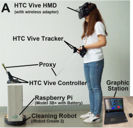
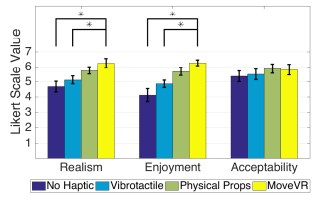

## MoveVR: Enabling Multiform Force Feedback in Virtual Reality using Household Cleaning Robot 读书报告

### 1 问题简述

​	这篇文章主要研究的是人机交互方面有关VR设备所提供的触觉反馈的内容。通过论文内容可以知道，现在市面上的VR设备虽然可以通过空间音频上的技术突破给用户呈现很逼真的3D场景和音效，但是现有的技术还无法给用户们很好的触觉上的体验，这对于模拟真实场景、提供沉浸式虚拟现实的体验来说是亟需提升、不可或缺的。

​	现在市面上能提供触觉体验的VR设备都有着诸多缺点。对于一些头戴的设备或者某些可穿戴设备，其只能对于人体的某个特定的部位提供触感，局限性比较大。对于现有的基于无人机的解决方案，由于其欠缺一定的驱动性，所以只能提供非常有限的力反馈。另外，一些能提供良好触感体验的设备很多都还处于实验研发阶段，量产可行性不高，同时这些设备的功能也过于局限，很难“搬出”实验室在市场上收到人们的青睐。

​	综合以上的问题分析和对于市场的调查，现需要一个对于大众来说易获得的，并且能给用户提供良好触觉体验的VR设备。

### 2 解决方案

#### 2.1 MoveVR的构成与组装

​	本篇论文的作者们结合上述所发现的问题，设计了一块名为**MoveVR**的设备。

​	在硬件方面，MoveVR由一个**扫地机器人**、一个机器人控制器(RMC)、一个装有地址追踪系统的头戴VR显示器(HMD)和一个图像工作站组成。对于研发团队的实验模型，他们采用了一款HTC Vivo Pro虚拟现实系统*iRobot Create 2*作为HMD，树莓派作为RMC以及外星人牌的笔记本作为图像工作站。

​	在软件方面，RMC上运行Create ROS驱动程序以实现一个控制脚本，图像工作站可以根据收集到的位置信息在不同场景下通过扫地机器人的控制单元发出控制命令，Python脚本可以转换从图像工作站发出的控制命令，并通过USB dongle控制扫地机器人的移动。

​	对于MoveVR的制作与组装，论文中将用于交互的对象定义为**代理**。代理分为三种：扫地机器人自己携带的代理、由用户单独持有并驱动的代理以及用于连接扫地机器人和用户的共享代理。这些代理可以从我们日常生活中的一些物品取得，如绳子作为共享代理以模拟张力的反馈、纸盒作为机器人携带代理、木棒作为用户独持代理等等。组装时利用家用的双面胶带、胶水、剪刀即可。最终成品大致如下图（截取自论文）：

#### 2.2 MoveVR的四种力反馈

​	根据论文内容，我们可以总结出MoveVR主要能够提供四种形式的力反馈，分别为绳子的张力、模拟材料刚度的反作用力、对抗用户的阻力和主动施加给用户的冲击力。其中，张力反馈可以应用于钓鱼、遛狗等场景，对抗用户的阻力反馈可以应用于一些定点位置的交互，冲击力反馈可用于攻击、撞击、触碰等场景。模拟材料刚性反作用力反馈可以使得用户和虚拟现实环境中的物体进行间接交互。

#### 2.3 MoveVR的创新与优点

1. MoveVR的创新点之一在于其使用了普通的家用扫地机器人来实现虚拟现实中的多种力反馈。这种创新对于生产材料的要求并不高，因为使用的东西家家户户都有，是家中常见的物品；组装方式也比较简单，在家即可轻松完成。易于组装、易于拆卸，并且不损害扫地机器人。
2. 通过研发团队的一系列研究，MoveVR可以在多个强度、方向和材料刚性等级上实现多种多样的力反馈，包括张力、阻力、冲击等等。
3. 通过研发团队对于用户体验的调查可以发现，与现在市面上有存在的多个支持触感的VR设备相比，MoveVR能够提供更逼真、更好的体验感。

### 3 实验支撑

​	该研发团队共进行了2个调查实验，分别为力感知实验和用户体验调查。

#### 3.1 力感知实验

​	此实验的目的为用过对于用户的调查，探索MoveVR提供多种层次可分辨的力强度和方向的能力大小。该实验将张力强度分为4个等级（L0-L3），张力方向分为5个方向（L，FL，F，FR，R），模拟材料刚性强度分为5个不同材料的强度（L0-L4），阻力强度分为3个等级（L1-L3），冲击力强度分为5个等级（L1-L3）。现让12位参与者先通过预实验了解各个等级强度及方向，在正式实验时，没人带着黑屏的VR显示器，对于每种力表达形式，随机给出4个等级的力反馈，让参与者进行感知分辨，判断当前强度/方向为哪一等级。

​	实验结果显示，参与者对于5个力表达形式的分辨准确率分别高达97.40%，97.08%，96.25%，96.88%，99.31%。同时，实验中的判断错误有可能是预实验与正式实验之间记忆衰退的结果。结合上述分析，可以说明MoveVR设备确实可以让用户们清楚区分出各个力的类别及反馈强度等级，说明其力反馈效果较好。

#### 3.2 用户体验调查

​	此实验的目的为评估MoveVR提供真实和舒适愉快的虚拟现实体验的能力。实验中设计的游戏场景为遛狗、挪箱子和用木棍击打敌人，共3个。本实验共4个实验组，分别为空白对照组（参与者只佩戴HTC Vive）、振动触觉组（参与者佩戴提供震动反馈的控制器）、被动触觉组（在现实中相关位置摆放虚拟环境中的物体）和MoveVR组。实验参与者共24人，并在事先不会被告知其实验组别，待参与者在实验室成功通过上述3个游戏场景后，会让其对VR游戏体验的真实性（Q1）、舒适度（Q2）、对于游戏中力反馈的易获得程度（Q3）进行打分，1最差4中等7最好。

​	最终可以看到，对于总三个场景的打分而言，MoveVR组的Q1、Q2、Q3评分分别为6.24/7，6.25/7，5.95/7，其中Q1和Q2评分都显著高于其他三组，而Q3评分即力反馈接受度略低于被动触觉组，但二者基本持平，柱状图如下。对于MoveVR组三个场景的Q1、Q2评分均分别高于对应场景的其他三组，而Q3评分在张力、冲击力反馈上的评分高于被动组，其余两种力反馈类型Q3评分与被动触觉组基本一致。

​	实验结果可以说明，相比其他的VR环境或设备，MoveVR设备可以给用户真实的、良好的VR体验。

### 4 论文不足与疑问

​	以下主要讨论论文中的产品MoveVR的一些待改进之处。

1. 本产品主要围绕扫地机器人打造，在MoveVR的组装过程中，MoveVR是需要手工组装的，所以该产品很难实现量产，而更适合于利用家中闲置物品打造从而提高自己的VR游戏体验。且为了提高用户体验，还需进一步提供装配指南和应用程序代码等等。
2. 在硬软件结合方面，不同款式的扫地机器人其运行功率等等会有差别，以及家中地板材质会有微小差别，故对于MoveVR设备中的程序参数等需要视具体情况而调整。
3. 由**3.2**中的实验的评分结果可知，MoveVR的力反馈的易获得程度有待提高，结合论文内容，研发团队也在考虑进一步找更适合、更贴近真实的多种物品作为代理，或者考虑用遥控车、平衡车等等代替扫地机器人以获得力反馈综合性能更好的产品。
4. 论文中所展现的MoveVR设备有一定的局限性。实验中的场景仅分别对应着张力、不同材料刚性、阻力、冲击力，然而在现实中有更多的感受触觉的方式，也有更多的人体部位可以感受的触觉。所以如何模拟更多形式的力反馈也是MoveVR设计团队未来可以着重考虑的问题。

​	当然，阅读完本篇论文，我还有一些疑惑与疑问。如在MoveVR原理及组装部分，文中并没有给出详细的、具体的有关如何实现图像处理站和控制器、扫地机器人等多方面的控制协调及其算法思路，若有更为具体的阐释则更佳。

### 5 总结与感想

​	本篇论文介绍了基于在家中日益普及的扫地机器人实现易于应用的触觉反馈设备MoveVR的制作原理与方法。实验证明MoveVR可以提供可区分的多级力反馈，与当前市面上商用的产生触觉解决方案相比能给用户更真实的VR体验，具有良好的扩展性和发展性。

​	通过阅读这篇论文，我对于人机交互（HCI）有了更多更深的了解与认识，特别是在触感（touch/haptic perception）这一方面。人所能感受体会到环境的感觉有很多，包括但不限于冷热、疼痛、压力等等。在当下虚拟现实（VR）发展火热，在观感、听感等方面都已经做的越来越真实，而触觉一直都是一个难以模拟仿真的难题。这篇论文所研究的内容让我看到了在家中玩VR游戏时能够比较便利的感受到触觉的可能性。现在正有越来越多、越来越好的方法能够增强VR体验中的触感体验，相信在不久的将来在这一方面会有更大的突破。